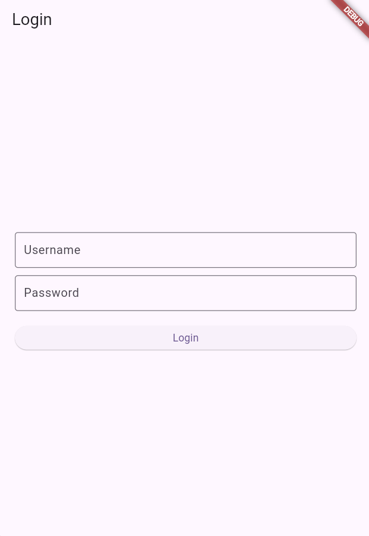
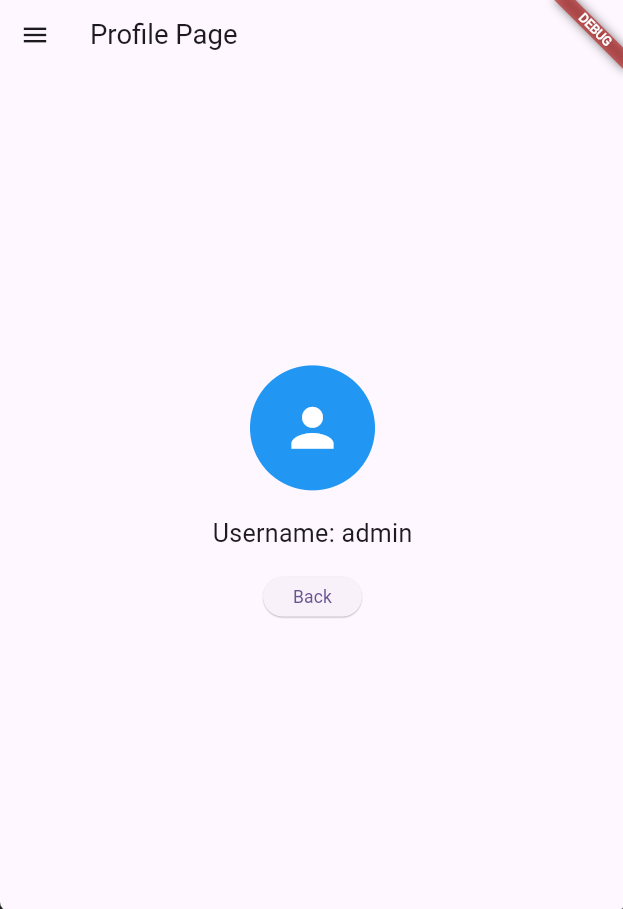
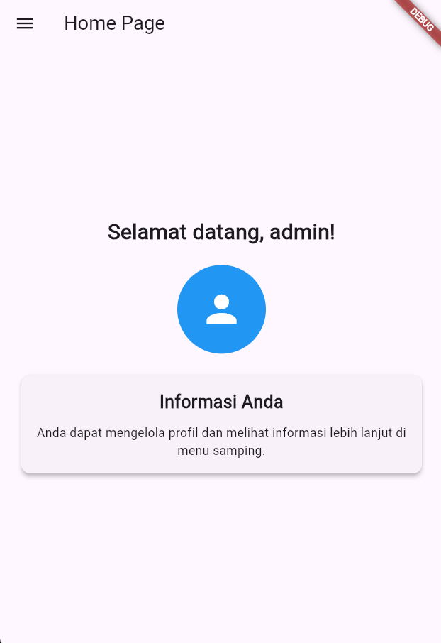
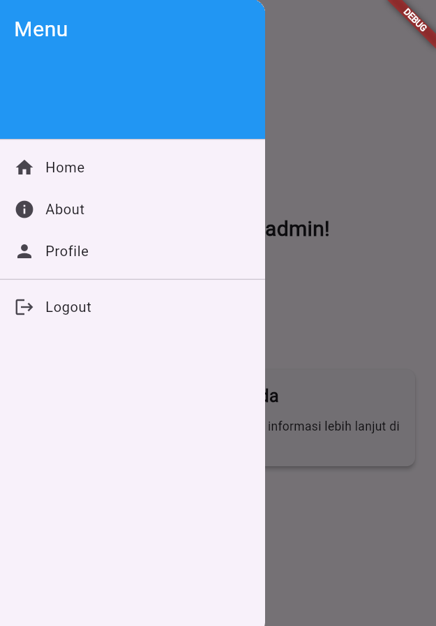
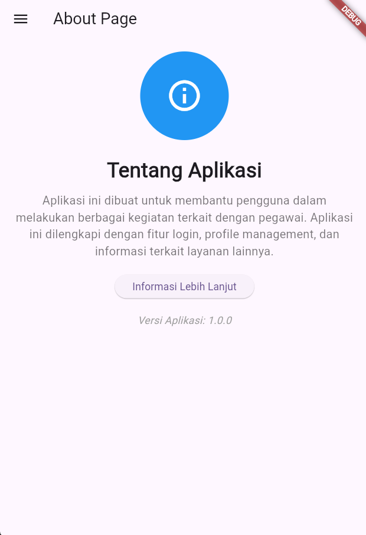

1. LoginPage
Tujuan: Halaman ini digunakan untuk mengautentikasi pengguna dengan username dan password.
Variabel: Menggunakan dua variabel untuk menyimpan input pengguna (username dan password).
Metode _saveUsername: Menyimpan username yang dimasukkan pengguna ke dalam penyimpanan lokal menggunakan SharedPreferences.
Metode _login: Memeriksa apakah username dan password yang dimasukkan sesuai dengan nilai yang ditentukan (dalam hal ini, "admin"). Jika cocok, pengguna diarahkan ke halaman beranda; jika tidak, muncul pesan kesalahan.
Antarmuka: Menampilkan dua kolom teks untuk input dan tombol untuk login.
2. HomePage
Tujuan: Halaman ini menyambut pengguna setelah login.
Variabel namauser: Menyimpan nama pengguna yang diambil dari SharedPreferences.
Metode _loadUsername: Mengambil nama pengguna dari penyimpanan lokal dan menampilkannya. Jika tidak ada, akan menampilkan "User".
Antarmuka: Menampilkan teks sambutan dengan nama pengguna di tengah halaman dan juga menyediakan menu samping untuk navigasi.
3. ProfilePage
Tujuan: Halaman ini menampilkan informasi profil pengguna.
Variabel username: Menyimpan nama pengguna yang diambil dari penyimpanan lokal.
Metode _loadUsername: Mengambil username dari SharedPreferences ketika halaman dimuat.
Antarmuka: Menampilkan avatar, nama pengguna, dan tombol untuk kembali ke halaman sebelumnya. Ini memberikan visual yang sederhana dan bersih.
4. AboutPage
Tujuan: Halaman ini memberikan informasi tentang aplikasi.
Antarmuka: Menampilkan teks statis yang menjelaskan tentang aplikasi. Halaman ini sederhana dan langsung.
5. Sidemenu
Tujuan: Menu samping yang menyediakan navigasi antara halaman-halaman di aplikasi.
DrawerHeader: Bagian atas menu yang berisi judul.
ListTile: Digunakan untuk setiap item dalam menu, termasuk link ke halaman Home, About, dan Profile.
Logout: Menyediakan opsi logout yang menampilkan pesan konfirmasi saat pengguna memilih untuk keluar. Logika logout dapat ditambahkan di sini untuk menghapus data pengguna dari penyimpanan.

